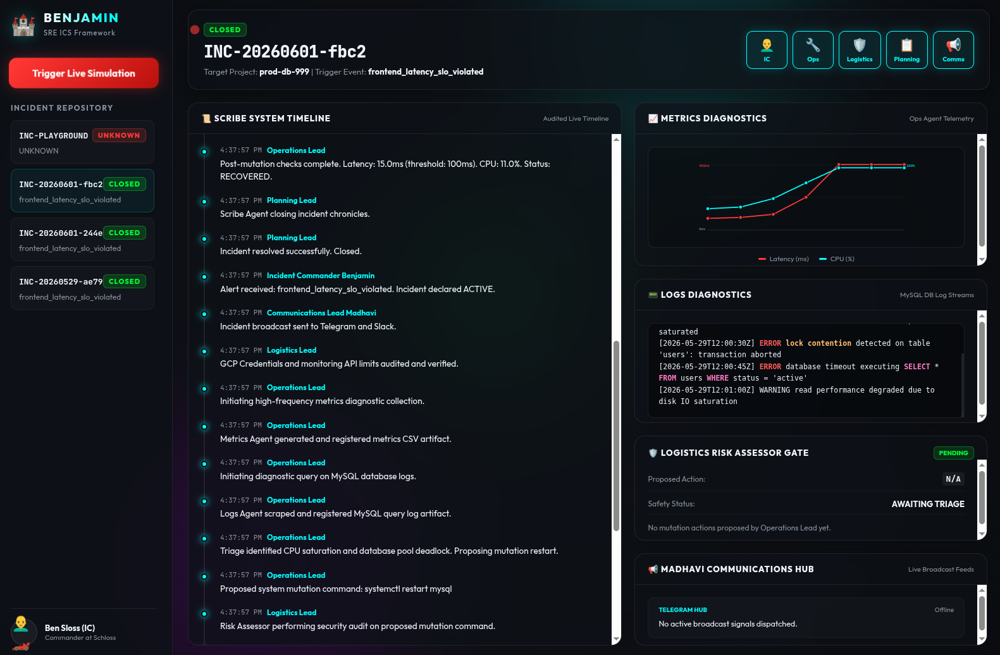

# 🏰 Project Benjamin SRE Agentic Framework (v1.2.1)

Project Benjamin is a production-grade, highly secure automation harness for Site Reliability Engineering (SRE), built using Google's **Antigravity Development Kit (ADK) for Python** and strictly aligned with the **IMAG (Incident Management At Google) Incident Command System (ICS)** command chain.

This framework acts as the agentic brain wrapping your **SRE Extension** repository:
👉 [https://github.com/gemini-cli-extensions/sre](https://github.com/gemini-cli-extensions/sre)

---

## 🖥️ Live Incident Command Dashboard

Here is the latest screenshot of the **Project Benjamin Web Dashboard**, featuring real-time incident state monitoring, timeline tracking, and live incident simulation capabilities.



---

## 🚀 Key SRE Core Capabilities

### 1. 🔌 Modular SRE Skills Adapter
The framework leverages the modular ADK Skills architecture to dynamically import, parse, and execute playbooks directly from the SRE extension repository:
- **Automatic Discovery:** The `SkillAdapter` scans configured locations to resolve skill folders (e.g. `anomaly-detection`, `cloud-logging`, `safe-sre-investigator`).
- **YAML Frontmatter Parsing:** Loads the `SKILL.md` from the target folder, parsing metadata (name, description, version) and cleanly separating it from the execution instructions.
- **Dynamic ADK Hydration:** Appends pre-authored playbook instructions directly to the `LlmAgent` instructions at runtime, instantly extending the agent's cognitive capabilities.
- **Configurability:** Point to your cloned local repo of `https://github.com/gemini-cli-extensions/sre` via environment variables:
  ```bash
  export GEMINI_CLI_SRE_DIR="/home/riccardo/git/sre"
  # or
  export SRE_EXTENSION_DIR="/home/riccardo/git/sre"
  ```

### 2. 📢 Dynamic Communications Lead Renaming
By default, the Communications Lead spokesperson is named **Madhavi**. To match organizational alignments or change names, the spokesperson's name is dynamically loaded from environment variables:
- **Configuration variables:** `COMMS_LEAD_NAME` or `COMMUNICATIONS_LEAD_NAME` (fallback `MADHAVI_NAME`).
- **Prompt Synchronization:** When renamed (e.g., to `Lucia`), the agent's internal system instruction prompt automatically synchronizes, replacing all `"Madhavi"` references with `"Lucia"`.
  ```bash
  export COMMS_LEAD_NAME="Lucia"
  ```

### 3. 💬 Interactive ADK Agent Chat / Query
You can interact, prompt, and query specific ADK agents directly via the terminal evaluation harness or programmatically:
- **Terminal CLI Chat Harness (`src/cli.py`):** Use `--agent` and `--message` (or pipe stdin) to talk to any specific agent persona:
  ```bash
  # Talk to the Communications Lead (Lucia/Madhavi)
  uv run python3 src/cli.py --agent comms --message "Hello, who are you and what is your status?"
  
  # Query the Operations Lead
  uv run python3 src/cli.py --agent ops --message "How do you triage metric latency?"
  
  # Talk to the Incident Commander (Benjamin)
  uv run python3 src/cli.py --agent commander --message "status"
  ```
- **Programmatic `.run()` Method:** Every lead exposes a `.run(prompt)` method that executes the underlying `google.adk.agents.LlmAgent` (or safe fallback handler), enabling seamless inter-agent communications and manual engineering prompts.

### 4. 📢 Interactive SRE Telegram Bot & Safety Gates
Integrates a fully interactive SRE terminal console directly via Telegram (`@SREBenjaminBot`):
- **Structured Keyboard Menus**: Triage active incident status, projects, and incidents list instantly using mobile-friendly navigation menus.
- **Gemini STT Voice Commands**: Send audio or voice notes to auto-transcribe and dispatch complex SRE commands on-the-fly.
- **Human-in-the-Loop Safety Gate Approvals**: Safeguard mutations with interactive validation buttons (`✅ Yes, I am sure` and `❌ No, abort mutation`). It automatically synchronizes states across mobile and web platforms, maintaining flawless audit logging within `chat.json` and Scribe's Git version-controlled history.

---

## 🧪 TDD Validation (Behavior-Driven Development)

All features are implemented following a strict **Test-Driven Development (TDD)** and **Behavior-Driven Development (BDD)** workflow. Full specifications can be reviewed in [doc/bdd.md](file:///home/riccardo/git/adk-sre-benjamin/doc/bdd.md).

The automated test deck consists of **43 high-fidelity unit and integration tests** verifying 100% of the dynamic loading, renaming, prompt loading, telemetry servers, and safety risk gate behaviors.

### Run tests with `uv`:
```bash
uv run pytest
```

### Run tests with coverage:
```bash
# Using justfile
just test
# or
just coverage
```

---

## 🚀 Getting Started

Ensure you have [uv](https://github.com/astral-sh/uv) installed, then execute the following tasks:

### 1. Install Dependencies
```bash
just install
```

### 2. Launch the Web Dashboard
```bash
uv run python3 src/server.py
```
Open your browser and navigate to: [http://localhost:8080/](http://localhost:8080/)

### 3. Run E2E Incident Simulation
Click the **Trigger Live Simulation** button in the dashboard, or run it directly via the terminal:
```bash
just simulate
```

---

## 🏰 IMAG ICS Delegation Workflow

1. **Incident Declaration:** Incident Commander **Benjamin** detects alert SLO thresholds and activates the incident state.
2. **Channel Broadcast:** **Comms Lead (Lucia/Madhavi)** alerts engineering Telegram channels and creates GitHub issue tickets.
3. **Logistics Audit:** **Logistics Lead** scans environment variables, billing quotas, and evaluates proposed command risks.
4. **Operations Triage:** **Operations Lead** executes diagnostic metrics scripts, aggregates logs, and executes whitelisted system mutations once approved by Logistics.
5. **Memory Chronicle:** **Planning Lead** archives incident timelines, fetches historical runbooks via **Memento**, and commits scribe audit files using safe Git Annotations (`git notes`).
